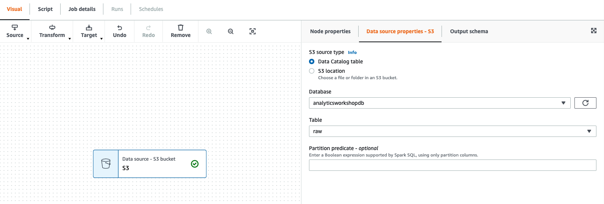
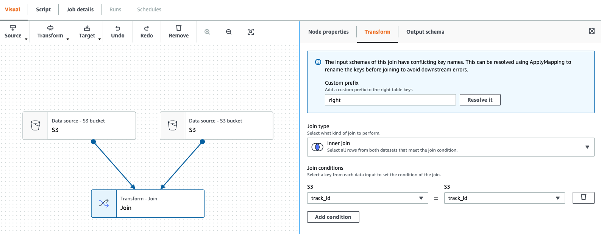

# Workshop: Analytics on AWS

Contributors:

* Vikas Omer | Amazon Web Services | [Linkedin](https://www.linkedin.com/in/vikas-omer/)
* Aneesh Chandra PN | Amazon Web Services | [Linkedin](https://www.linkedin.com/in/aneesh-chandra-pn/)
* Chatchai Komrangded | Amazon Web Services | [Linkedin](https://www.linkedin.com/in/chatchaikomrangded/)

# Pre-requisites:  
Completed the previous modules   
* Ingest and Storage [link](../modules/ingest.md)
* Catalog Data [link](../modules/catalog.md)

# Transform Data with AWS Glue Studio

## What is AWS Glue Studio
AWS Glue Studio is a new graphical interface that makes it easy to create, run, and monitor extract, transform, and load (ETL) jobs in AWS Glue. You can visually compose data transformation workflows and seamlessly run them on AWS Glue’s Apache Spark-based serverless ETL engine.

In this lab, We will do the same ETL process like 
* Transform Data with AWS Glue [link](../modules/transform_glue.md)

But This time We will leverage visual graphical interface in AWS Glue Studio!

---
* GoTo : https://console.aws.amazon.com/gluestudio/home?region=us-east-1
  * Click - **Job** and Choose **Blank graph**

  * Click **Create**

* Click - **Source** and Choose - **S3**

* Click tab **Data source properties - S3**
* In S3 source type Choose **Data Catalog table** 
* Choose following value
    * Database - **analyticsworkshopdb**
    * Table - **raw**
  

* Repeat the step to Click - **Source** and Choose - **S3**

* Click tab **Data source properties - S3**
* In S3 source type Choose **Data Catalog table** 
* Choose following value
    * Database - **analyticsworkshopdb**
    * Table - **reference_data**
  

* Click node either on the left, or right

* Click **Transform** and Choose **Join**

* You should get the visual diagram like screenshot below, and message on the right "Insufficient source nodes" because you need another node (Data source) to join

* Next You click on **Transform - Join** node, and On Node properties select drop downlist and tick all S3 data source like screenshot below:

* Click **Transform tab** in Join node Click **Add condition**

* Use **track_id** for join columns like screenshot below.

* In Join node Click **Transform** and Choose **ApplyMapping**

* You should get the output like below screenshot

* You should get the output like below screenshot

* We will drop unused columns following
    * .track_id
    * parition_0
    * parition_1
    * parition_2
    * parition_3
  

* Click **Transform - ApplyMapping** node
  

* Click **Target** and Choose **S3**
  

* You should get the visual output as below screenshot
  

* In Data target properties - S3 Fill up the information as below:
    * Format **Glue Parquet**
    * Compression Type **Snappy**
    * S3 Target Location **s3://yourname-analytics-workshop-bucket/data/processed-data2/**
    * Data Catalog update options
      * Choose **Create a table in the Data Catalog and on subsequent runs, update the schema and add new partitions**
      * Database **analyticsworkshopdb**
      * Table name **processed-data2**

* Click **Job details** and configure with following option
   * Name **AnalyticsOnAWS-GlueStudio**
   * IAM Role **AWSGlueServiceRoleDefault**
   * Number of workers **2**
   * Job bookmark **Disable**
   * Number of retries **1**
   * Job timeout (minutes) **10**
   * Leave the rest as default value
   * Click **Save**
   

* You see "Successfully created job" then Click **Save** 
   

* You should see "Successfully started job", then Click **Run Details** 
   

  

It will take close to 10 mins for the new Glue console to spin up.

You have to wait for this step to complete before moving to next step.

## Create SageMaker Notebooks (Jupyter) for Glue Dev Endpoints

* GoTo: https://console.aws.amazon.com/glue/home?region=us-east-1#etl:tab=notebooks
* Select tab : **Sagemaker notebooks**
* Click: **Create notebook**
  * Notebook name: **notebook1**
  * Attach to development endpoint: **devendpoint1**
  * Choose: **Create an IAM role**
  * IAM Role: **notebook1**
  * VPC (optional): Leave blank
  * Encryption key (optional): Leave blank
  * Click: **Create Notebook**

This will take few minutes, wait for this to finish

## Launch Jupyter Notebook
- Download and save this file locally on your laptop : [summit-techfest-datalake-notebook.ipynb](../summit-techfest-datalake-notebook.ipynb)
- GoTo: https://console.aws.amazon.com/glue/home?region=us-east-1#etl:tab=notebooks
- Click - **aws-glue-notebook1**
- Click - **Open**, This will open a new tab
- On Sagemaker Jupyter Notebook 
  - Click - Upload (right top part of screen)
  - Browse and upload **summit-techfest-datalake-notebook.ipynb** which you downloaded earlier
  - Click - **Upload** to confirm the download
  - Click on **summit-techfest-datalake-notebook.ipynb ** to open the notebook
  - Make sure it says **'Sparkmagic (PySpark)'** on top right part of the notebook, this is the name of the kernel Jupyter will use to execute code blocks in this notebook

**Follow the instructions on the notebook**
	  - Read and understand the instructions, they explain important Glue concepts

## Validate - Transformed / Processed data has arrived in S3

Once the ETL script has ran successfully.
console:https://s3.console.aws.amazon.com/s3/home?region=us-east-1

* Click - **yourname-datalake-demo-bucket > data**
* There should be a folder called **processed-data** created here > Open it & ensure that .parquet files are created in this folder.

> Back to [main page](../readme.md)