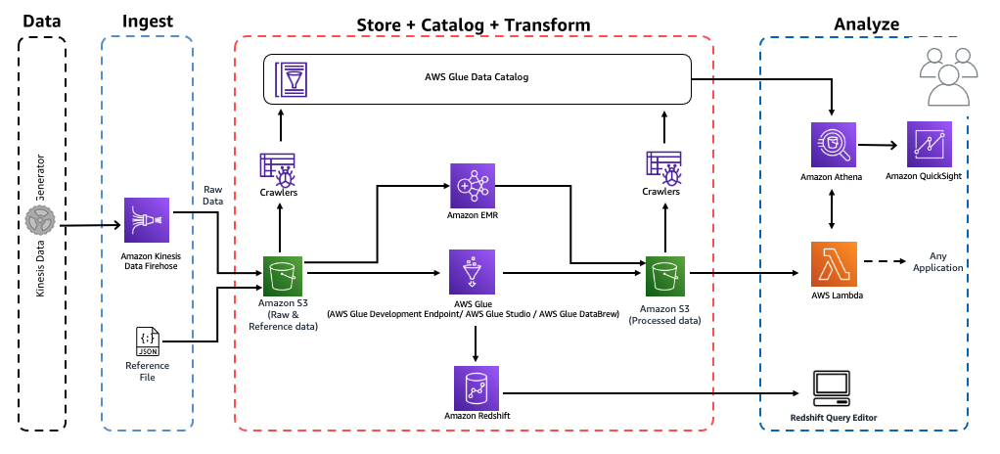

# Workshop: Analytics on AWS

Contributors:

* Vikas Omer | Amazon Web Services | [Linkedin](https://www.linkedin.com/in/vikas-omer/)
* Aneesh Chandra PN | Amazon Web Services | [Linkedin](https://www.linkedin.com/in/aneesh-chandra-pn/)
* Chatchai Komrangded | Amazon Web Services | [Linkedin](https://www.linkedin.com/in/chatchaikomrangded/)

### Lab Architecture

### Learning outcomes from this workshop?
* Design serverless data lake architecture
* Build a data processing pipeline and Data Lake using Amazon S3 for storing data
* Use Amazon Kinesis for real-time streaming data
* Use AWS Glue to automatically catalog datasets
* Data Transformation
  * Run interactive ETL scripts in an Amazon SageMaker Jupyter notebook connected to an AWS Glue development endpoint
  * Use Glue Studio to run, and monitor ETL jobs in AWS Glue. 
  * Use Glue DataBrew to do data preparation
  * Use EMR to run a Spark transformation job
* Load data to Amazon Redshift from Glue
* Intro into Amazon Redshift Best design practices.
* Query data using Amazon Athena & visualize it using Amazon QuickSight

# Pre-requisites:  
* You need to have access to an AWS account with **AdminstratorAccess**
* This lab should be executed in **us-east-1** region
* Best is to **follow links from this  guide** & open them **in new a tab**
* Run this lab in a modern browser

# Modules

**Module** | **Link**
--- | ---
Ingest and Store | [link](./modules/ingest.md)
Catalog Data | [link](./modules/catalog.md)
Transform Data with AWS Glue | [link](./modules/transform_glue.md)
Transform Data with AWS Glue Studio | [link](./modules/transform_glue_studio.md)
Transform Data with AWS Glue DataBrew | [link](./modules/transform_glue_databrew.md)
Transform Data with EMR | [link](./modules/emr.md)
Analyze with Athena | [link](./modules/analyze.md)
Visualize with Quicksight | [link](./modules/visualize.md)
Lambda | [link](./modules/lambda.md)
Redshift | [link](./modules/redshift.md)
Cleanup | [link](./modules/cleanup.md)

Please do check on the pre-requisites for each module before starting the activities within the module.

Also, do not forget to clean up the resources at the end of the workshop!

### Build on!

